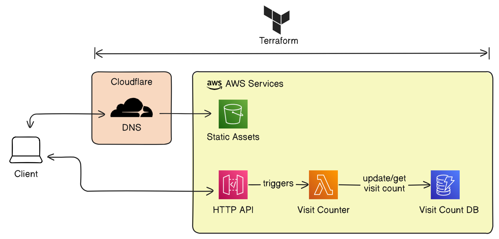

# AWS Cloud Resume Challenge

This repo contains the code for the [Cloud Resume Challenge](https://cloudresumechallenge.dev/) project. The cloud resume project is a static site deployed to s3 with a lambda function that logs page visits to a dynamodb table.



> [!NOTE]
> The portfolio git submodule is an actual blog site of mine made with astro.js. If you want to use the same site, make sure you update the dependencies as the newer releases of the site may not be compatible with the current code base.

## Running the project

1. Clone the repository with the submodules (`git clone <url> --recurse-submodules`)
2. If you are not using aws sso, then remove profile specific lines from modules and `terraform-example-vars.txt`

`modules/function/main.tf`
`modules/website/main.tf`
```diff
provider "aws" {
    region = var.aws_region
-   profile = var.aws_profile
}
```

3. Copy the example terraform var file `terraform-example-vars.txt` to `terraform.tfvars` and follow any instructions in the file to fill in the required values.

```bash
cp terraform-example-vars.txt terraform.tfvars
```

4. Build the lambda function

> [!WARNING]
> While the terraform deployment allows you to choose region of your choice, make sure you change the region in `modules/function/function.ts` to the region of your choice.

```bash
cd modules/function
pnpm install && pnpm build
```

5. Comment out the website module in the root `main.tf` and run terraform to deploy the lambda function, api gateway and dynamodb table.

```bash
terraform init
terraform apply
```

6. Once the infrastructure is deployed, you will receive the http api endpoint. Change the endpoint in `portfolio/src/site.config.ts` to the endpoint you received.

```ts
export const siteConfig: SiteConfig = {
    ...
    pageVisitAPI: '<api-endpoint>',
}
```
7. Build the website static files

```bash
cd portfolio
pnpm install && pnpm build
```

8. Rerun step 5 with website module to upload static files to s3.